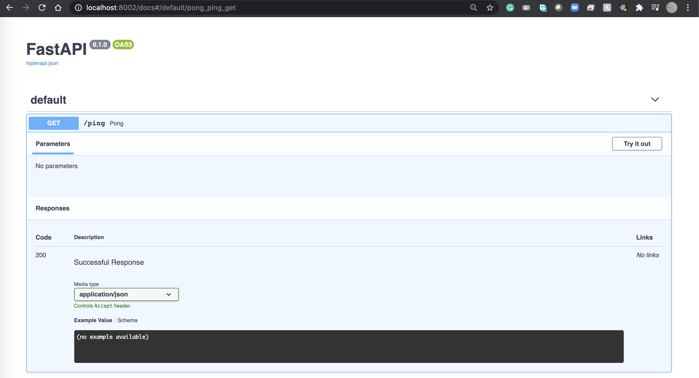
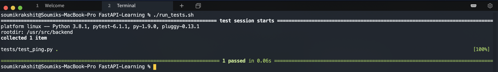

# Simple Ping

In this introductory part, we would setup the whole project, containerize it using docker, create a simple route and set write testcases to test our ping!

## Directory Structure

```
.
|-- README.md
|-- build_backend.sh
|-- docker-compose.yml
|-- parts
|   `-- part_1.md
|-- run_tests.sh
`-- src
    |-- Dockerfile
    |-- backend
    |   |-- __init__.py
    |   |-- api
    |   |   `-- ping.py
    |   `-- main.py
    |-- requirements.txt
    `-- tests
        |-- __init__.py
        |-- conftest.py
        `-- test_ping.py
```

## Containerization

### Dockerfile

We would be using Docker to containerize our application. Docker is a platform for developers and sysadmins to build, run, and share applications with containers. Fundamentally, a container is nothing but a running process, with some added encapsulation features applied to it in order to keep it isolated from the host and from other containers. One of the most important aspects of container isolation is that each container interacts with its own private filesystem; this filesystem is provided by a Docker image. An image includes everything needed to run an application - the code or binary, runtimes, dependencies, and any other filesystem objects required.

Docker can build images automatically by reading the instructions from a `Dockerfile`. A Dockerfile is a text document that contains all the commands a user could call on the command line to assemble an image. Using the `docker build` command, users can create an automated build that executes several command-line instructions in succession.

Now, we would define our Dockerfile for building the container for our backend:

```dockerfile
# Pull Base Image
FROM python:3.8.1-alpine

# Set Working Directory
RUN mkdir /usr/src/backend
WORKDIR /usr/src/backend

# Set Environment Variables
ENV PYTHONDONTWRITEBYTECODE 1
ENV PYTHONUNBUFFERED 1

# Copy requirements.txt
COPY ./requirements.txt /usr/src/backend/requirements.txt

# Install Dependencies
RUN set -eux \
    && apk add --no-cache --virtual .build-deps build-base \
        libressl-dev libffi-dev gcc musl-dev python3-dev

# Install Python Dependencies
RUN pip install --upgrade pip setuptools wheel
RUN pip install -r /usr/src/backend/requirements.txt

# Remove pip cache
RUN rm -rf /root/.cache/pip

# Copy Project to Working Directory
COPY . /usr/src/backend/

```

For a more detailed guide for writing a Dockerfile, refer to the [official documentation](https://docs.docker.com/get-started/part2/).

### Managing Multiple Containers

Now, note that a Full Stack Application would not only consist of the Rest APIs, but also a frontent server like React, Angular or Streamlit. Ideally, we would want the backend and the frontend server to be isolated and independent of each other. This means that we need to create separate containers for the backend and the frontend. So, how do we manage multiple contatiners???

**Compose** comes to the rescue!

**Compose** is a tool for defining and running multi-container Docker applications. With Compose, we can use a YAML file to configure our application’s services. Then, with a single command, we can create and start all the services from our configuration.

We would now define our `docker-compose.yml` file which would include all the services that make up our app. For a more detailed guide for writing a compose file, refer to the [official documentation](https://docs.docker.com/compose/compose-file/).

```yaml
version: '3.7'

services:
  web:
    build: ./src
    command: uvicorn backend.main:backend --reload --workers 1 --host 0.0.0.0 --port 8000
    volumes:
      - ./src/:/usr/src/backend/
    ports:
      - 8002:8000
```

Let's break down the Compose file:

- `version: '3.7'` refers to the Compose file format which corresponds to Docker Engine Release `18.06.0+`.
- The compose file defines
    - services: configuration that is applied to each container started for a particular service (in this case, for running the uvicorn server).
    - networks: lets us specify the networks to be created.
    - volumes:  create named volumes that can be reused across multiple services.

In our case, we have simply defined the services that concerns our app. This includes the build directory containing the `Dockerfile`, the command to start our service (the uvicorn server), a named volume and mapping the application ports withing the container.

In order to build our application container and start our services, we would simply use the command `docker-compose up -d --build` (this command is included in the `build_backend.sh` script) and to stop our services, we can simply hit `docker-compose down`.

## The Application

The `backend` directory consists of the FastAPI application. The `api` directory consists of all the routes while `main.py` contains the actual application.

Let us define a simple FastAPI route in `src/backend/api/ping.py`:

```python
from fastapi import APIRouter

router = APIRouter()

# A simple HTTP GET route
@router.get('/ping')
async def pong():
    return {'ping': 'pong'}
```

Now let us include this route in our FastAPI application in `src/backend/main.py`:

```python
from fastapi import FastAPI
from .api import ping

backend = FastAPI()

backend.include_router(ping.router)
```

Now let's build the project by running `build_backend.sh`. The server would start serving at [http://localhost:8002/](http://localhost:8002/). If you visit the route [http://localhost:8002/ping](http://localhost:8002/ping), you should get the response `{"ping":"pong"}`. You can also try out the routes using the interactive API docs provided by Swagger UI at [http://localhost:8002/docs](http://localhost:8002/docs).



## Testing the Application

We can test our routes by visiting them individually, as well as by using the interactive documentation. While this might work for a couple of routes in case of a small application, it would not be feasible for a large application with a large number of routes. Hence, we would write testcases for testing our all of our routes. In our case, we would be using `pytest` as our testing framework and the Test Client part of the `starlette` library for making requests against our application.

### Pytest Fixtures

Fixtures are functions, which will run before each test function to which it is applied. Fixtures are used to feed some data to the tests such as database connections, URLs to test and some sort of input data. Therefore, instead of running the same code for every test, we can attach fixture function to the tests and it will run and return the data to the test before executing each test. A function is marked as a fixture by decorating it with `@pytest.fixture`.

We would define our fixtures inside `src/tests/conftest.py`

```python
import pytest
from starlette.testclient import TestClient
from backend.main import backend


@pytest.fixture(scope='module')
def test_backend():
    client = TestClient(backend)
    yield client
```

Now, let's create a testcase for our ping route in `src/tests/test_ping.py`:

```python
def test_ping(test_backend):
    response = test_backend.get('/ping')
    assert response.status_code == 200
    assert response.json() == {'ping': 'pong'}
```

Once the project is built, we can run our tests using `docker-compose exec web pytest .` which is included inside `run_tests.sh`. A successful testcase execution would give us a prompt similar to the following:


